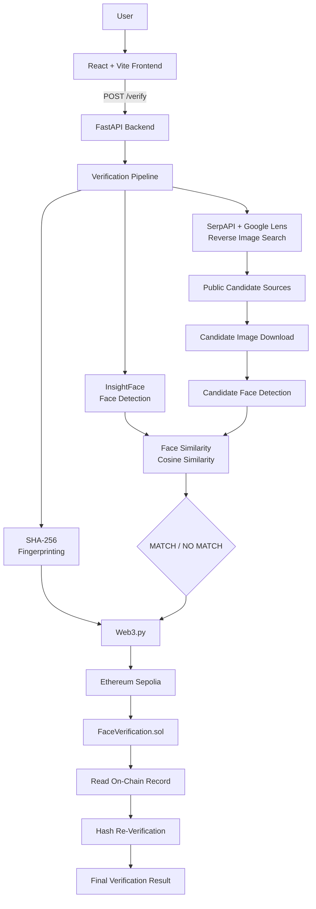
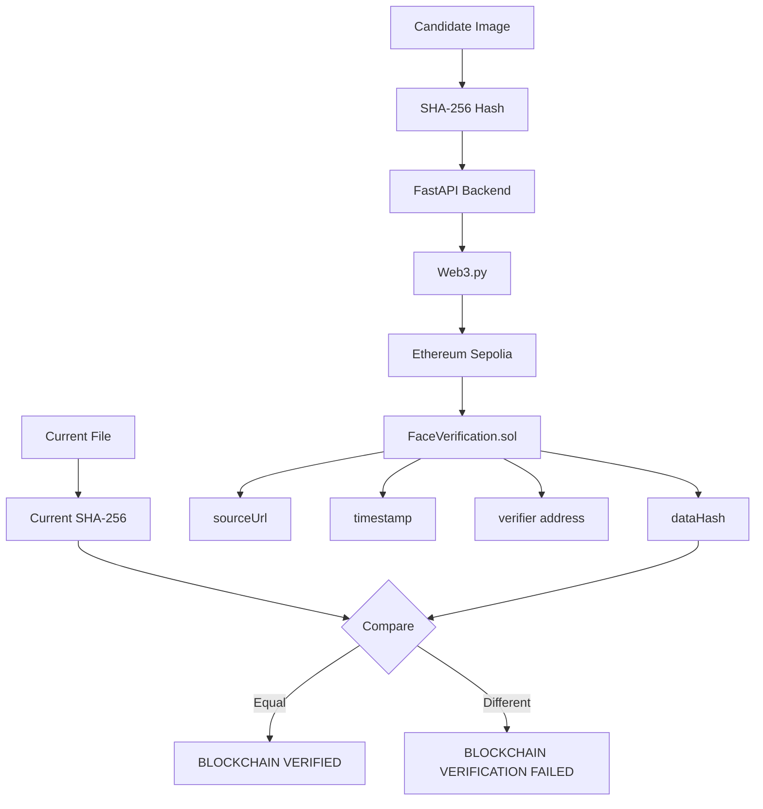

# FaceChain Verify

> **Face Identification & Blockchain Verification — HH Goa 2026, Shortlisting Task 3**

FaceChain Verify is an academic proof-of-concept that combines **computer vision, genuine reverse-image search, face similarity analysis, cryptographic hashing, and blockchain verification** into one end-to-end workflow.

The system accepts a face image, discovers publicly indexed candidate sources through reverse-image search, compares detected faces using InsightFace embeddings, creates a SHA-256 fingerprint, stores verification metadata on **Ethereum Sepolia**, and reads the blockchain record back to re-verify the stored fingerprint.

> **Responsible-use note:** Face similarity is a technical matching signal. It does **not** by itself establish a person's legal identity, prove ownership of a social-media account, or prove that two accounts belong to the same person.

---

## Overview

The complete pipeline is:

```text
User uploads image
        │
        ▼
Face Detection
        │
        ▼
Face Embedding
        │
        ▼
Genuine Reverse Image Search
        │
        ▼
Google Lens / Public Web Results
        │
        ▼
Candidate Image Discovery
        │
        ▼
Candidate Face Detection
        │
        ▼
Face Similarity Comparison
        │
        ▼
MATCH / NO MATCH
        │
        ▼
SHA-256 Fingerprint
        │
        ▼
Ethereum Sepolia
        │
        ▼
Smart Contract Storage
        │
        ▼
Read On-Chain Record
        │
        ▼
Hash Re-Verification
        │
        ▼
Final Verification Result
```

### Core idea

FaceChain Verify brings together five distinct technical layers:

| Layer | Purpose |
|---|---|
| Computer Vision | Detect faces and generate embeddings |
| Reverse Image Search | Discover publicly indexed candidate sources |
| Face Similarity | Compare the input face with candidate faces |
| Cryptographic Hashing | Generate a deterministic file fingerprint |
| Blockchain | Provide tamper-evident storage and re-verification of that fingerprint |

---

## Assignment

This project was built for:

**HH Goa 2026 — Shortlisting Task 3**  
**"Face Identification & Blockchain Verification"**

The assignment requirements are:

1. Face detection / encoding
2. Genuine web or social-media search
3. At least one real matching public social/web result
4. Blockchain upload / verification of discovered data or a hash/fingerprint
5. Re-verification against the on-chain record
6. GitHub repository
7. End-to-end screen recording / demo

The implementation includes these components.

A separate website was not required by the assignment, but a **React + Vite frontend** was built to provide a cleaner demonstration interface.

---

## Key Features

- Face detection and embedding using **InsightFace**
- `buffalo_l` InsightFace model
- CPU execution through `CPUExecutionProvider`
- Genuine reverse-image search using **SerpAPI + Google Lens**
- Public web/social candidate discovery
- Candidate image downloading and validation
- Face comparison using cosine similarity
- Configurable project threshold currently set to **0.57**
- SHA-256 candidate-file fingerprinting
- Ethereum Sepolia blockchain integration
- Solidity smart contract for verification records
- On-chain record read-back
- Hash re-verification
- FastAPI backend
- React + Vite frontend
- Error handling across search, image, face detection, and blockchain stages
- Independent face-matching test script

---

# End-to-End Workflow

## 1. User Input

The user uploads a face image through the frontend.

The frontend sends the image to:

```http
POST /verify
```

using `multipart/form-data`.

The FastAPI backend receives the image and starts the verification pipeline.

---

## 2. Face Detection

The project uses **InsightFace** for face detection and recognition.

**Model:**

```text
buffalo_l
```

**Execution provider:**

```text
CPUExecutionProvider
```

Implementation:

```text
pipeline/face_detection.py
```

Responsibilities include:

- Loading the InsightFace model
- Detecting faces
- Generating face embeddings
- Handling difficult-to-detect faces

The detector uses:

```python
det_size=(640, 640)
```

If a face is not detected initially, the system attempts image upscaling and retries detection.

---

## 3. Face Embedding

Once a face is detected, InsightFace generates a numerical face embedding.

Conceptually:

```text
Face Image
    │
    ▼
Face Detection
    │
    ▼
Face Alignment / Recognition
    │
    ▼
Numerical Face Embedding
```

The embedding is used for similarity comparison.

**The face embedding is not stored on the blockchain.**

---

## 4. Genuine Reverse Image Search

Implementation:

```text
pipeline/reverse_search.py
```

The system performs a genuine reverse-image search using:

- **SerpAPI**
- **Google Lens**

The uploaded image is prepared for the external image-search service:

```text
Open image
   ↓
Convert to RGB
   ↓
Resize if necessary
   ↓
Compress to JPEG
   ↓
Keep upload below API-supported size
   ↓
Upload to SerpAPI
   ↓
Receive image_id
   ↓
Send image_id to Google Lens
   ↓
Retrieve search results
```

Search results can contain:

- Exact matches
- Visual matches
- Public web results
- Public social-media results

The system does not use hardcoded social-media results for this stage.

---

## 5. Candidate Discovery

The reverse-search module identifies supported public platforms from result URLs.

### Supported platforms

| Platform | URL pattern |
|---|---|
| Instagram | `instagram.com` |
| Facebook | `facebook.com` |
| LinkedIn | `linkedin.com` |
| GitHub | `github.com` |
| X | `x.com` |
| Twitter | `twitter.com` |

Only supported public web/social results are selected for the candidate stage.

Additional processing includes:

- Duplicate URL removal
- Candidate ranking
- Exact-match results being preferred over visual matches

> A reverse-image-search result is a **candidate source**, not automatic proof that the face belongs to the person represented by that source.

---

## 6. Candidate Image Download

For each usable result, the system attempts to download a candidate image.

The downloader:

- Uses HTTP requests
- Sends browser-like headers
- Validates the response
- Opens the returned image
- Verifies that it is a valid image
- Converts it to JPEG
- Saves it locally for comparison

If the primary image URL fails, a fallback thumbnail URL can be attempted.

---

## 7. Candidate Face Matching

Each candidate image is processed using the same InsightFace detector.

If multiple faces are detected in a candidate image:

```text
Candidate Image
      │
      ▼
Detect all faces
      │
      ├── Face A → Compare
      ├── Face B → Compare
      ├── Face C → Compare
      └── ...
      │
      ▼
Highest similarity score
```

The candidate face with the highest similarity to the input face is selected for evaluation.

Implementation:

```text
pipeline/matcher.py
```

---

## 8. Similarity Calculation

Face similarity is calculated using **cosine similarity** between the two face embeddings.

Formula:

```text
similarity =
    dot(embedding1, embedding2)
    ───────────────────────────────
    norm(embedding1) × norm(embedding2)
```

The similarity score is normalized/clipped between `0` and `1`.

### Current threshold

```text
0.57
```

Decision rule:

```text
score >= 0.57  → MATCH
score <  0.57  → NO MATCH
```

The system evaluates candidate faces and keeps the highest similarity score.

> The threshold and the test values below are project-level demonstration settings. They are **not a universal biometric accuracy benchmark**.

---

## 9. SHA-256 Fingerprinting

Implementation:

```text
pipeline/hashing.py
```

After the candidate is selected, the project generates a SHA-256 fingerprint.

```text
Candidate Image
      │
      ▼
    SHA-256
      │
      ▼
64-character hexadecimal fingerprint
```

The hash provides a deterministic fingerprint of the file.

If the file changes, its SHA-256 fingerprint changes.

### What is not stored on-chain

- Original image
- Face embedding
- API keys
- Private credentials
- Sensitive biometric data

---

# System Architecture



---

# Architecture Diagram

The main application is divided into frontend, backend, verification pipeline, external services, and blockchain layers.

```text
                         ┌─────────────────────┐
                         │        USER         │
                         │   Upload Face Image │
                         └──────────┬──────────┘
                                    │
                                    ▼
                         ┌─────────────────────┐
                         │    React + Vite     │
                         │      Frontend       │
                         └──────────┬──────────┘
                                    │
                               POST /verify
                                    │
                                    ▼
                         ┌─────────────────────┐
                         │    FastAPI Backend  │
                         │     backend.py      │
                         └──────────┬──────────┘
                                    │
                                    ▼
                         ┌─────────────────────┐
                         │ Verification        │
                         │ Pipeline             │
                         │ app.py              │
                         └──────────┬──────────┘
                                    │
                ┌───────────────────┼───────────────────┐
                │                   │                   │
                ▼                   ▼                   ▼
       ┌────────────────┐  ┌─────────────────┐  ┌──────────────┐
       │ Face Detection │  │ Reverse Search  │  │   SHA-256    │
       │   InsightFace  │  │ SerpAPI + Lens  │  │  Fingerprint │
       └───────┬────────┘  └────────┬────────┘  └──────┬───────┘
               │                    │                   │
               │                    ▼                   │
               │            Public Candidates          │
               │                    │                   │
               └──────────┬─────────┘                   │
                          ▼                             │
                 ┌──────────────────┐                  │
                 │ Face Similarity   │                  │
                 │ Cosine Similarity │                  │
                 └────────┬─────────┘                  │
                          │                             │
                          ▼                             │
                  ┌───────────────┐                     │
                  │ MATCH / NO    │                     │
                  │ MATCH         │                     │
                  └───────┬───────┘                     │
                          │                             │
                          └────────────┬────────────────┘
                                       ▼
                                ┌─────────────┐
                                │   Web3.py   │
                                └──────┬──────┘
                                       ▼
                              ┌────────────────┐
                              │ Ethereum Sepolia│
                              └───────┬────────┘
                                      ▼
                           ┌────────────────────┐
                           │FaceVerification.sol│
                           └─────────┬──────────┘
                                     ▼
                           ┌────────────────────┐
                           │ Read On-Chain Data │
                           └─────────┬──────────┘
                                     ▼
                           ┌────────────────────┐
                           │ Hash Re-Verification│
                           └─────────┬──────────┘
                                     ▼
                           ┌────────────────────┐
                           │   FINAL RESULT     │
                           └────────────────────┘
```

---

# Technology Stack

| Component | Technology |
|---|---|
| Frontend | React |
| Frontend Tooling | Vite |
| Backend | FastAPI |
| Runtime | Python 3.12.13 |
| Face Detection / Embeddings | InsightFace |
| Model | `buffalo_l` |
| Execution | CPUExecutionProvider |
| Reverse Image Search | SerpAPI + Google Lens |
| Face Matching | Cosine Similarity |
| Hashing | SHA-256 |
| Blockchain | Ethereum Sepolia |
| Blockchain Library | Web3.py |
| Smart Contract | Solidity |
| Contract Tooling | Hardhat |
| Backend Deployment | Render |
| Frontend Deployment | Vercel |

---

# Project Structure

```text
Face-verification/
│
├── app.py
├── backend.py
├── README.md
├── requirements.txt
├── .gitignore
├── .env
│
├── pipeline/
│   ├── __init__.py
│   ├── face_detection.py
│   ├── matcher.py
│   ├── reverse_search.py
│   ├── hashing.py
│   ├── blockchain.py
│   └── report.py
│
├── frontend/
│   ├── src/
│   │   ├── components/
│   │   └── pages/
│   ├── package.json
│   └── ...
│
├── blockchain/
│   ├── contracts/
│   ├── ignition/
│   ├── artifacts/
│   ├── hardhat.config.ts
│   └── package.json
│
├── sample/
│   ├── candidates/
│   ├── test.png
│   └── test2.png
│
├── uploads/
│
└── test_face_match.py
```

> `.env` is shown only to describe the local project structure. **It must never be committed with real credentials.**

---

# Module Responsibilities

| File / Module | Responsibility |
|---|---|
| `app.py` | Main end-to-end verification pipeline |
| `backend.py` | FastAPI API, request handling, verification execution, JSON response, candidate-image proxying |
| `pipeline/face_detection.py` | InsightFace model loading, face detection, embeddings, upscaling/retry |
| `pipeline/matcher.py` | Cosine similarity, candidate face comparison, best candidate selection, threshold decision |
| `pipeline/reverse_search.py` | SerpAPI upload, Google Lens search, result extraction, platform filtering, candidate image download |
| `pipeline/hashing.py` | SHA-256 file fingerprint generation |
| `pipeline/blockchain.py` | Web3.py connection, smart-contract interaction, transactions, confirmation, record reading, hash verification |
| `pipeline/report.py` | Verification report generation |
| `frontend/src/pages/Home.jsx` | Main verification UI, upload, API call, result and candidate display, blockchain information |
| `blockchain/contracts/` | Solidity smart contract |
| `test_face_match.py` | Independent face similarity testing |

---

# Frontend

The frontend is built using:

```text
React + Vite
```

It provides the visual interface for the verification pipeline.

### Frontend responsibilities

1. Accept an image upload
2. Send the image to the FastAPI backend
3. Wait for verification
4. Display the verification result
5. Display candidate information
6. Display face similarity
7. Display blockchain verification information

### Local addresses

Backend:

```text
http://127.0.0.1:8000
```

Frontend:

```text
http://localhost:5173
```

The frontend communicates with:

```http
POST /verify
```

---

# Backend API

## `POST /verify`

Starts the complete verification pipeline.

### Request

Content type:

```http
multipart/form-data
```

Field:

```text
file=<image>
```

### Example request

```bash
curl -X POST http://127.0.0.1:8000/verify \
  -F "file=@test.png"
```

### Response

The response includes fields such as:

```json
{
  "match": true,
  "similarity": 0.82,
  "source_url": "...",
  "candidate_image": "...",
  "candidates": [],
  "file_hash": "...",
  "blockchain": {},
  "blockchain_verification": {}
}
```

### Important response fields

| Field | Meaning |
|---|---|
| `match` | Final face-similarity decision |
| `similarity` | Highest candidate-face similarity |
| `source_url` | Selected public source URL |
| `candidate_image` | Selected candidate image |
| `candidates` | Candidate evaluation data |
| `file_hash` | SHA-256 fingerprint |
| `blockchain` | Blockchain transaction information |
| `blockchain_verification` | Result of on-chain hash verification |

---

# Smart Contract

The smart contract is:

```text
FaceVerification
```

The contract stores verification records containing:

```solidity
struct Verification {
    bytes32 dataHash;
    string sourceUrl;
    uint256 timestamp;
    address verifier;
}
```

## Main functions

### `verifyData`

```solidity
verifyData(
    bytes32 _dataHash,
    string memory _sourceUrl
)
```

Creates a new verification record.

### `getVerification`

```solidity
getVerification(uint256 _index)
```

Reads a specific verification record.

### `getVerificationCount`

```solidity
getVerificationCount()
```

Returns the total number of verification records.

## Event

The contract emits:

```text
DataVerified
```

with:

- `dataHash`
- `sourceUrl`
- `timestamp`
- `verifier`

---

# Blockchain Architecture



---

# Blockchain Flow

The blockchain service performs the following operations:

1. Connects to the Sepolia RPC endpoint
2. Loads the smart contract
3. Builds the transaction
4. Uses EIP-1559 gas parameters
5. Signs the transaction
6. Sends the transaction
7. Waits for confirmation
8. Reads the transaction receipt
9. Gets the transaction hash
10. Gets the block number
11. Checks the transaction status

A successful transaction has:

```text
Transaction Status = 1
```

---

# On-Chain Re-Verification

After a successful blockchain transaction, the backend reads the newly created verification record.

The record contains:

```text
Stored Hash
Stored Source URL
Timestamp
Verifier Address
```

The system then compares:

```text
Current SHA-256
       │
       ▼
Compare with
       │
       ▼
On-Chain SHA-256
```

If:

```text
current_hash == stored_hash
```

the result is:

```text
BLOCKCHAIN VERIFIED
```

Otherwise:

```text
BLOCKCHAIN VERIFICATION FAILED
```

This verifies that the fingerprint being checked matches the fingerprint stored on-chain.

---

# Separation of Verification Signals

A central design principle of FaceChain Verify is that different stages answer different questions.

| Layer | What it tells us |
|---|---|
| Reverse Image Search | Finds publicly indexed candidate sources |
| Face Similarity | Measures embedding/visual similarity between detected faces |
| Blockchain | Provides tamper-evident integrity for the stored fingerprint |

These signals must **not** be treated as interchangeable.

### Specifically

- A reverse-image result does not automatically mean the face matches.
- A face similarity score does not prove account ownership.
- Blockchain verification does not prove a person's identity.

The blockchain layer verifies the **integrity of the stored fingerprint**, not biometric identity.

---

# Error Handling

The backend and reverse-search pipeline handle cases including:

- Missing API key
- Failed image upload
- Invalid image
- Candidate image download failure
- Face not detected
- Reverse-search failure
- Blockchain connection failure
- Blockchain transaction failure
- Invalid blockchain record

The reverse-image-search uploader also compresses large images before sending them to SerpAPI because the external image-upload service has a size restriction.

---

# Environment Variables

The project uses environment variables for external services and blockchain access.

Expected variables include:

```text
SERPAPI_KEY
SEPOLIA_RPC_URL
SEPOLIA_PRIVATE_KEY
SEPOLIA_CONTRACT_ADDRESS
```

### Security requirements

**Never place real values in `README.md`.**

**Never commit `.env`.**

The blockchain private key is used only by the backend to sign blockchain transactions.

The frontend must never contain the blockchain private key.

A safe `.env` example can look like:

```env
SERPAPI_KEY=your_serpapi_key
SEPOLIA_RPC_URL=your_sepolia_rpc_url
SEPOLIA_PRIVATE_KEY=your_private_key
SEPOLIA_CONTRACT_ADDRESS=your_contract_address
```

> Use placeholder values only. Never replace them with real credentials in the repository.

---

# Installation

## Requirements

The development environment used:

```text
Python 3.12.13
```

You also need Node.js/npm for the React frontend.

---

## 1. Clone the repository

```bash
git clone <your-repository-url>
cd Face-verification
```

---

## 2. Create a Python virtual environment

```bash
python -m venv .venv
```

### Windows

```bash
.venv\Scripts\activate
```

---

## 3. Install Python dependencies

```bash
python -m pip install -r requirements.txt
```

---

## 4. Configure environment variables

Create a local `.env` file and provide the required service and blockchain configuration.

Do not commit this file.

---

# Running Locally

## Start the backend

From the project root:

```bash
python -m uvicorn backend:app --reload --port 8000
```

Backend:

```text
http://127.0.0.1:8000
```

---

## Start the frontend

Open another terminal:

```bash
cd frontend
npm install
npm run dev
```

Frontend:

```text
http://localhost:5173
```

---

## Run the direct pipeline

```bash
python app.py
```

---

# Testing

The project includes an independent face-matching test:

```bash
python test_face_match.py
```

This test checks the similarity behavior of the matcher independently from the complete reverse-search/blockchain pipeline.

---

# Test Results

The following project-level demonstration results were obtained:

| Test Case | Similarity | Threshold | Result |
|---|---:|---:|---|
| Same image | `1.0000` | `0.5700` | **MATCH** |
| Same subject, different photo | `0.6641` | `0.5700` | **MATCH** |
| Different subject | `0.1521` | `0.5700` | **NO MATCH** |
| Reverse-search candidate | `0.5639` | `0.5700` | **NO MATCH** |
| Successful reverse-search candidate | `0.8200` | `0.5700` | **MATCH** |

### Interpretation

These values demonstrate the behavior of the implemented pipeline under the tested examples.

They should **not** be interpreted as a general biometric accuracy benchmark, production accuracy guarantee, or universal threshold recommendation.

---

# Successful End-to-End Blockchain Flow

One successful end-to-end demonstration produced:

```text
Face Similarity: 0.8200
Threshold:       0.5700
Decision:        MATCH
Blockchain:      VERIFIED
```

The successful flow demonstrated that the system could:

1. Generate a SHA-256 fingerprint
2. Submit the fingerprint to the smart contract
3. Receive a transaction hash
4. Receive a confirmed block
5. Read the stored record
6. Compare the current hash with the on-chain hash
7. Return `BLOCKCHAIN VERIFIED`

The transaction was confirmed on **Ethereum Sepolia**.

> Public transaction hashes may be included in project documentation only when they are intentionally being shared as demo references. Never include private keys or credentials.

---

# Deployment

The current deployment architecture is:

```text
User
  │
  ▼
Vercel React Frontend
  │
  ▼
Render FastAPI Backend
  │
  ├── InsightFace
  │
  ├── SerpAPI / Google Lens
  │
  ├── Candidate Face Comparison
  │
  ├── SHA-256
  │
  └── Ethereum Sepolia
```

## Backend

Deployment platform:

```text
Render
```

Service:

```text
jhalak-ai
```

Production backend:

```text
https://jhalak-ai.onrender.com
```

Start command:

```bash
uvicorn backend:app --host 0.0.0.0 --port $PORT
```

Build command:

```bash
pip install -r requirements.txt
```

Environment variables are configured in the deployment platform.

## Frontend

Deployment platform:

```text
Vercel
```

Production frontend:

```text
https://jhalak-ai.vercel.app
```

---

# GitHub

The project is maintained as a GitHub repository.

Recommended repository hygiene:

- Keep the production project state on the main branch.
- Use the development branch for development/deployment workflow.
- Never commit `.env`.
- Never expose private keys or API credentials.
- Keep generated secrets out of commit history.

---

# Demo / Screen Recording Flow

For an end-to-end assignment demonstration, show the following sequence:

1. Open the application
2. Upload a face image
3. Show face detection
4. Show reverse-image search
5. Show a public search result
6. Show the candidate image
7. Show the face similarity score
8. Show `MATCH` / `NO MATCH`
9. Show the SHA-256 fingerprint
10. Show the blockchain transaction
11. Show the block number
12. Show transaction status
13. Read the blockchain record
14. Show `BLOCKCHAIN VERIFIED`
15. Explain that the current hash matches the on-chain hash

The demo should make the complete pipeline visible from **image input → candidate discovery → face comparison → hashing → blockchain storage → blockchain re-verification**.

---

# Security

The system separates secret credentials from application code through environment variables.

### Important security rules

- Never expose `SERPAPI_KEY`.
- Never expose `SEPOLIA_PRIVATE_KEY`.
- Never expose RPC credentials.
- Never commit `.env`.
- Never put the blockchain private key in the frontend.
- Do not store face embeddings on-chain.
- Do not store the original image on-chain.

The blockchain stores only the verification fingerprint and source metadata defined by the smart contract.

---

# Privacy and Responsible Use

FaceChain Verify is an **academic proof-of-concept**.

Face similarity should not be treated as identity proof.

A matching face embedding does **not** prove:

- Legal identity
- Ownership of a social-media account
- Authorship of an online post
- That two accounts belong to the same person

Reverse-image search results are based on publicly indexed sources and third-party search services.

### The system should not be used for:

- Harassment
- Stalking
- Impersonation
- Unauthorized surveillance
- High-impact identity decisions
- Claiming account ownership solely from facial similarity

Only process images and information that you are authorized to use.

---

# Limitations

## Face Recognition Limitations

Face recognition and similarity can be affected by:

- Lighting
- Pose
- Camera angle
- Image resolution
- Image quality
- Face size
- Occlusion
- Facial expression

A similarity threshold that works for project demonstrations is not automatically appropriate for other datasets or real-world applications.

## Reverse Image Search Limitations

Search quality depends on:

- Publicly indexed images
- Search-engine availability
- Third-party API availability
- Source accessibility
- Image quality

A missing search result does **not** mean that a matching image does not exist.

Social-media pages can also be inaccessible or dynamically generated.

## Blockchain Limitations

Blockchain provides integrity for the stored fingerprint, but it does not independently verify biometric identity.

In other words:

```text
Blockchain Verified
        ≠
Identity Verified
```

---

# Design Principles

## 1. Separation of Concerns

Face detection, matching, reverse search, hashing, blockchain, backend, and frontend responsibilities are separated into dedicated modules.

## 2. Verification Layers

Each layer has a distinct purpose:

```text
Reverse Search → Candidate Discovery
Face Matching  → Similarity Signal
Blockchain     → Fingerprint Integrity
```

## 3. No Biometric Data on Blockchain

The blockchain stores the cryptographic fingerprint and source metadata rather than the original image or face embedding.

## 4. Re-Verification

The pipeline does not stop after blockchain upload.

It reads the blockchain record and compares the hash again.

## 5. Genuine External Search

The reverse-search stage uses the external search service rather than hardcoded social-media results.

## 6. Candidate Ranking

Exact matches are prioritized over visual matches, and face similarity is used to evaluate candidate images.

---

# Future Improvements

The following are **future improvements only** and are not claimed as currently implemented features:

- Better threshold calibration using a larger evaluation dataset
- Improved multi-candidate ranking
- Better face-quality filtering
- Asynchronous reverse search
- Search-result caching
- Stronger API validation
- Database-backed verification history
- Improved frontend result visualization
- Transaction-explorer integration
- Automated test suite
- Production-grade authentication
- Privacy-preserving storage
- Better monitoring and logging

---

# What This Project Demonstrates

FaceChain Verify demonstrates how several independent technologies can be connected into a single verification workflow:

```text
Computer Vision
      +
Reverse Image Search
      +
Face Similarity
      +
Cryptographic Hashing
      +
Blockchain
      ↓
End-to-End Verification Pipeline
```

The project is intentionally designed so that each component has a clearly defined role rather than treating every signal as proof of identity.

---

# Conclusion

FaceChain Verify is an academic proof-of-concept demonstrating an end-to-end workflow for **candidate discovery, technical face similarity analysis, cryptographic fingerprinting, and blockchain integrity verification**.

The key engineering concept is the separation of these signals:

```text
Reverse Search
     ↓
Candidate Source Discovery

Face Similarity
     ↓
Technical Matching Signal

SHA-256
     ↓
Deterministic File Fingerprint

Ethereum Sepolia
     ↓
Tamper-Evident Fingerprint Storage

On-Chain Read-Back
     ↓
Fingerprint Re-Verification
```

This architecture provides a clear demonstration of how **computer vision + web search + cryptography + blockchain** can work together while keeping the distinction between **technical verification signals and real-world identity claims** explicit.
